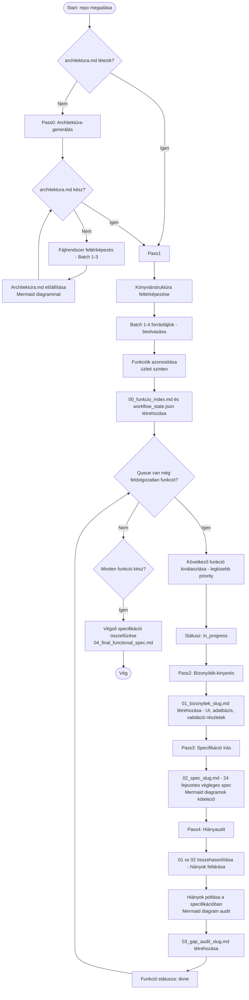

# Hermes Functional Spec Skills — Rendszerleíró Dokumentáció

Ez a fájl részletesen bemutatja, hogyan működik az `hermes-functional-spec-skills-v5` skill-csomag, milyen lépésekben dolgozza fel egy repository-t, és hogyan gyárt belőle magyar nyelvű funkcionális specifikációt.

---

## 1. Mi ez a rendszer?

Ez egy többpasszos, queue-alapú automatizált dokumentációs workflow, amely forráskódból részletes, magyar nyelvű funkcionális specifikációkat állít elő. A folyamat úgy lett tervezve, hogy:

- **Megszakítás után folytatható** (checkpointok és állapotfájlok alapján)
- **Funkció-központú** (nem technikai osztályokat dokumentál, hanem üzleti funkciókat)
- **Veszteségmentes** (minden UI elem, validáció, modal, adatművelet, státuszváltás dokumentálandó)
- **Diagram-támogatott** (Mermaid sequence/state/flowchart ábrák kötelezőek ahol indokolt)

---

## 2. A skill-csomag összetétele

A rendszer 6 fő komponensből áll:

| Komponens | Leírás | Verzió |
|-----------|--------|--------|
| `functional-spec-supervisor` | Workflow-irányító, állapotkezelő, queue-menedzser | 1.1.0 |
| `functional-spec-pass0-architecture-generator` | Architektúra-dokumentum előállítása (architektura.md) | 1.1.0 |
| `functional-spec-pass1-indexer` | Funkciók azonosítása, queue és workflow_state.json létrehozása | 1.1.0 |
| `functional-spec-pass2-evidence` | Bizonyíték-kinyerés funkciónként (UI, adatbázis, validáció) | 1.0.0 |
| `functional-spec-pass3-spec-writer` | Végleges specifikáció írása a bizonyítékokból | 1.0.0 |
| `functional-spec-pass4-gap-audit` | Minőségellenőrzés, hiányok feltárása és pótlása | 1.0.0 |

---

## 3. Teljes folyamat áttekintése (Mermaid)



---

## 4. Részletes passz-magyarázat

### PASSZ0: Architektúra-generálás (Pass0)

Ez a workflow **kötelező első lépése**. A rendszer ellenőrzi, hogy a repository gyökerében létezik-e `architektura.md` fájl. Ha nem, akkor előállítja azt.

**Hogyan dolgozza fel a repót:**

1. **Feltérképezés (Inventory):** Listázza a repo gyökerét, azonosítja a kulcsfontosságú fájlokat (`package.json`, `Dockerfile`, `docker-compose.yml`, `README.md` stb.)
2. **Batch 1 — Konfigurációs fájlok:** Beolvassa a build/config fájlokat (max 5-6 fájl)
3. **Batch 2 — Komponens réteg:** Beolvassa a controller-, service-, entity-, repository-fájlokat (max 5-8 fájl/batch)
4. **Batch 3 — UI és segédnyagok:** Beolvassa template-, modal-, validator-, i18n-fájlokat (max 5-8 fájl/batch)
5. **Generálás:** A beolvasott tartalom alapján létrehozza az `architektura.md` fájlt magyar nyelven, a következő fejezetekkel: mappastruktúra, szoftver architektúra, frontend/backend komponensek, API végpontok, autentikáció, domain modell, adatbázis technológia, külső kapcsolatok, programozási nyelvek, rate limitek, health check, logolás, szerepkörök, i18n, deployment, időzített folyamatok
6. **Mermaid diagram:** A fájl végén egy architektúra-ábra készül a `/diagram-maker` skill segítségével

**Checkpoint mechanizmus:** Minden batch után mentés történik `_pass0_checkpoint.json` fájlba, így megszakítás utáni folytatáskor az utolsó befejezett fázistól lehet indulni.

---

### PASSZ1: Indexelés (Pass1)

A repository tartalmának elemzése üzleti funkciók azonosítására, valamint a feldolgozási queue létrehozása.

**Hogyan dolgozza fel a repót:**

1. **Előkészítés:** Beolvassa az `architektura.md` fájlt (ha létezik) a modulhatárok és rendszerkapcsolatok megértéséhez
2. **Inventory:** Teljes könyvtárszerkezet feltérképezése (`find` vagy `tree`)
3. **Batch 1 — Konfiguráció:** Beolvassa a belépési konfigurációs fájlokat (package.json, Dockerfile, docker-compose, README, fő route indexek)
4. **Batch 2 — Funkcionális réteg:** Beolvassa controller-eket, service-eket, view komponenseket, entitásokat, migrációkat
5. **Batch 3 — UI elemek:** Beolvassa pages-, views-, components-, forms-, modal-fájlokat
6. **Batch 4 — Validáció és infra:** Beolvassa validator-okat, guard-okat, middleware-eket, notification fájlokat, enum-okat

**Elemzés után létrehozza:**
- `00_funkcio_index.md` — emberbarát funkciólista minden kapcsolódó információval (frontend fájlok, backend fájlok, entitások, képernyők, route-ok, endpointok, validátorok)
- `workflow_state.json` — gépi állapotfájl a queue kezeléséhez

**Prioritási szabály:** Nagy, központi üzleti funkciók, több képernyőt érintő funkciók, adatbázis-műveletben gazdag funkciók és sok validációt tartalmazó funkciók kapnak magasabb prioritást.

---

### PASSZ2: Bizonyíték-kinyerés (Pass2) —_FUNCÍÓNKÉNT FUT_

Minden egyes funkcióról veszteségmentes dokumentum készül, amely a kódból közvetlenül levezethető tényeket rögzíti, még specifikációs formátum nélkül.

**Bemenet:** `00_funkcio_index.md` + a funkcióhoz tartozó forráshelyek
**Kimenet:** `01_bizonyitek_<slug>.md`

**A bizonyítékfájl tartalmazza:**

1. **Funkció azonosítása** — név, üzleti cél, kapcsolódó képernyők/modalok/route-ok/endpointok/entitások
2. **Architekturális kontextus** — modul/réteg, shared komponensek, külső integrációk
3. **Szerepkörök és jogosultságok** — ki használhatja, szerepkörfüggő eltérések, guard-ok teljes kibontása
4. **UI bizonyítékok** — képernyők, szekciók, táblázatok, oszlopok, beviteli mezők (default értékek, lehetséges értékek, tooltip-ek, hibaüzenetek)
5. **Interaktív elemek** — gombok, ikonok, linkek, checkboxok, dropdownok: hol találhatók, mikor látható/hidden/disabled, aktiváláskori hatás, validáció, adatváltozás, navigáció/modal nyitás
6. **Modalok és dialógusok** — megnyitási feltétel, megjelenített adatok, mezők, gombok, háttérműveletek, bezáráskori állapot
7. **Adatkezelési bizonyítékok** — select/load/query, szűrési/rendezési szabályok, insert/update/delete, archive/history, trigger-hatások, tábla/oszlop szintű változások
8. **Validációs és üzleti szabályok** — mezőszintű validáció, egyediségvizsgálat, szerepkör/státusz-függő szabályok, konkrét hibaüzenetek
9. **Értesítések, audit, állapotok** — értesítési mechanizmusok, audit log, státuszváltások és tranzíciós feltételeik

**Kötelező kibontási szabály:** Technikai helperneveket (pl. `canBeActive`, `isEditable`) teljes üzleti feltételrendszerre kell bontani — nem elég azt írni, hogy melyik változó felel érte, hanem pontosan milyen feltételek együttállása esetén igaz/hamis.

---

### PASSZ3: Specifikáció írás (Pass3) —_FUNCÍÓNKÉNT FUT_

A bizonyítékfájl tartalmából végleges, üzleti nyelvű, fejlesztésre alkalmas specifikációt készít.

**Bemenet:** `01_bizonyitek_<slug>.md`
**Kimenet:** `02_spec_<slug>.md` — 24 fejezetes dokumentum

**A specifikáció kötelező fejezetei:**

| # | Fejezet | Tartalom |
|---|---------|----------|
| 1 | Funkció célja | Miért létezik ez a funkció |
| 2 | Rövid üzleti leírás | Folyamat leírása természetes nyelven |
| 3 | Érintett szerepkörök | Ki használhatja, ki nem |
| 4 | Belépési pontok | Honnan indítható a funkció |
| 5 | Előfeltételek | Mi kell a működéshez (jogosultság, adat) |
| 6 | Fő folyamat | Normál flow lépésről lépésre |
| 7 | Alternatív ágak és kivételes esetek | Hibakezelés, error states |
| 8 | Validációs szabályok | Minden mező validációja |
| 9 | Adatok és entitások | Milyen adatokat kezel a funkció |
| 10 | Adatműveletek és tartósítás | Insert/update/delete/query részletei |
| 11 | Állapotok és állapotváltozások | Státuszmachine, tranzíciós feltételek |
| 12 | Külső kapcsolatok | API hívások, webhookok, integrációk |
| 12/A | Architekturális kontextus | Modulhatárok, kód-architektúra eltérések |
| 13 | Értesítések és kommunikáció | Push, email, in-app értesítések |
| 14 | Audit, naplózás, nyomkövetés | Változásnaplók, audit trail |
| 15 | Képernyőspecifikáció | ASCII wireframe + leírás |
| 16 | Képernyőelemek részletes specifikációja | Minden mező: jelentés, adatforrás, default, kötelezőség, validáció |
| 17 | Interaktív elemek és felhasználói akciók | Gombok, ikonok, linkek működése |
| 18 | Akciómátrix | Milyen akció milyen kontextusban elérhető |
| 19 | Gombok és ikonok működési leírása | Megjelenés, rejtettség, disabled feltételek, hatás |
| 20 | Modális ablakok és dialógusok | Minden modal: tartalom, mezők, validáció, háttérművelet |
| 21 | Feltételes megjelenés és dinamikus UI szabályok | Mikor mi látszik/ rejtett |
| 22 | Sequence diagram | Komponensek közötti kommunikáció (Mermaid) |
| 23 | State diagram | Állapotváltások (Mermaid) |
| 24 | Nyitott kérdések / nem egyértelmű részek | Amit a kódból nem lehetett egyértelműen kideríteni |

**Diagram szabályok:** Sequence és state diagramok kötelezőek ahol indokolt, mindig a `/diagram-maker` skill használatával. ASCII wireframe kötelező minden képernyőhöz (15. fejezet).

---

### PASSZ4: Hiányaudit (Pass4) —_FUNCÍÓNKÉNT FUT_

A végső minőségellenőrzés: összehasonlítja a bizonyítékfájlt a specifikációval, és pótolja a hiányokat.

**Bemenet:** `01_bizonyitek_<slug>.md` + `02_spec_<slug>.md`
**Kimenet:** `03_gap_audit_<slug>.md` (audit jelentés) + javított `02_spec_<slug>.md`

**Az audit kötelezően ellenőrzi:**

1. **Funkciószerkezet** — minden 24 fejezet szerepel-e, nincs-e túl rövid/általános rész
2. **UI teljesség** — képernyők, nézetek, modalok, táblázatok, mezők dokumentálva?
3. **Mezőszintű teljesség** — értékkészlet, default, validáció, hibaüzenet, tooltip, readonly/hidden/disabled szabályok?
4. **Akciónk teljessége** — gombok, ikonok, linkek, sorakciók dokumentálva? Láthatósági feltételek üzletileg kibontva?
5. **Adatműveleti teljesség** — lekérdezések, szűrés, rendezés, insert/update/delete, archive/history/trigger?
6. **Egyéb** — értesítések, audit log, állapotváltozások, külső kapcsolatok, nyitott kérdések?
7. **Diagram audit** — sequence/state diagramok hiányoznak? Szintaktikailag helyesek? `/diagram-maker`-rel ellenőrizve?
8. **Architektúra audit** — architektúra-leírás figyelembe véve? Kód-architektúra eltérések dokumentálva?

Ha hiányt talál, a Pass4 **nem csak felsorolja**, hanem **pótolja is** a `02_spec_<slug>.md` fájlban.

---

## 5. Állapotkezelés (workflow_state.json)

A rendszer egyetlen hiteles állapotfájlja a `workflow_state.json`. Minden funkcióról tartalmazza:

```json
{
  "id": "f01_dashboard_index",
  "name": "Dashboard lista nézet",
  "priority": 1,
  "status": "done",
  "pass2": "done",
  "pass3": "done",
  "pass4": "done",
  "evidence_file": "01_bizonyitek_f01_dashboard_index.md",
  "spec_file": "02_spec_f01_dashboard_index.md",
  "gap_file": "03_gap_audit_f01_dashboard_index.md",
  "last_updated": "2026-05-21T19:00:00Z",
  "notes": ""
}
```

**Lehetséges státuszok:** `todo`, `in_progress`, `done`, `failed`, `skipped`

A supervisor mindig a legkisebb priority értékű, még nem lezárt funkciót választja ki következőnek. Megszakítás után a state fájl alapján folytatja — ha egy funkció Pass2-n megállt, azt kell befejezni először.

---

## 6. Fájlszerkezet és kimenetek

Egy modul specifikációs mappája így néz ki:

```
docs/functional-spec/module-profile-admin/
├── workflow/
│   └── workflow_state.json       ← fő állapotfájl
├── index/
│   └── 00_funkcio_index.md       ← emberbarát funkciólista
├── evidence/
│   ├── 01_bizonyitek_f01_xxx.md  ← bizonyítékfájlok funkciónként
│   ├── 01_bizonyitek_f02_yyy.md
│   └── ...
├── specs/
│   ├── 02_spec_f01_xxx.md        ← végleges specifikációk
│   ├── 02_spec_f02_yyy.md
│   └── ...
├── audits/
│   ├── 03_gap_audit_f01_xxx.md   ← hiányaudit jelentések
│   ├── 03_gap_audit_f02_yyy.md
│   └── ...
├── final/
│   └── 04_final_functional_spec.md  ← összefűzött végső dokumentum
├── changes/
│   └── 05_change_log_f01_xxx.md     ← változásnaplók (opcionális)
└── logs/
    └── progress.log                ← futás naplója
```

---

## 7. Folytatás és újrafuttatás (Resume & Rerun)

**Megszakítás utáni folytatás:** A supervisor mindig a `workflow_state.json` alapján dönti el, hol tartott. Ha egy funkció Pass2-n megállt, azt kell befejezni vagy újrafuttatni — nem szabad vakon továbblépni.

**Változásdetektálás (v3+):** Git diff alapú változásdetektálással a supervisor csak az érintett funkciók passzait állítja vissza `pending` státuszra, nem kell újra generálni az egész specifikációt.

**Modul-szintű újrafuttatás:** Ha egy modul kódja változott, csak annak a moduleknek a passzai futnak le újra, a többi érintetlen marad.

---

## 8. Diagramok a rendszerben

A Mermaid diagramokat a `/diagram-maker` skill generálja vagy ellenőrzi. A szabályok:

| Típus | Mikor kötelező | Generálás módja |
|-------|----------------|-----------------|
| Egyszerű flowchart (< 5 node) | Döntési fa, alapfolyamat | Python inline (szabálykönyvtárral) |
| Alap sequence diagram (2-3 participant) | Login, egyszerű API hívás | Python inline |
| Bonyolult state diagram (> 10 state) | Workflow státuszok, életciklus | `/diagram-maker` tool |
| Multi-service sequence diagram | Hibaüzenet kezelés, tranzakció | `/diagram-maker` tool |

**Kötelező szabályok:** Rövid node-nevek, HTML tag tiltás, konzervatív él-címkék, parser-biztos szintaxis. Ha egy diagram túl nagy, bontani kell kisebb ábrákra.

---

## 9. Minőségi követelmények

- **Funkció-központúság:** A dokumentáció üzleti funkciókat ír le, nem technikai osztályokat
- **Teljesség:** A rövidség nem cél — minden mező, gomb, modal, validáció, adatművelet dokumentálandó
- **Kibontás:** Technikai helpernevek (`canBeActive`, `isEditable`) teljes üzleti feltételrendszerre bontandók
- **Eszközök:** Minden állítás mellé forráshelyet kell adni (fájl, komponens, metódus, SQL)
- **Diagramok:** Sequence és state diagramok kötelezőek ahol indokolt, mindig `/diagram-maker` ellenőrzéssel

---

## 10. Mikor használd?

Ezt a skill-csomagot akkor érdemes elindítani, amikor:

- Egy teljes repository vagy modul dokumentációját kell előállítani forráskódból
- A specifikációt rendszeresen frissíteni kell (pl. aktív fejlesztés alatt)
- Megszakítás utáni folytatás szükséges (checkpointok támogatottak)
- Részletes, fejlesztésre alkalmas funkcionális leírásra van szükség — nem csak overview, hanem mezőszintű dokumentáció minden UI elemről és adatműveletről

**Belépési pont:** A `/functional-spec-supervisor` prompt használata a teljes workflow elindításához.
